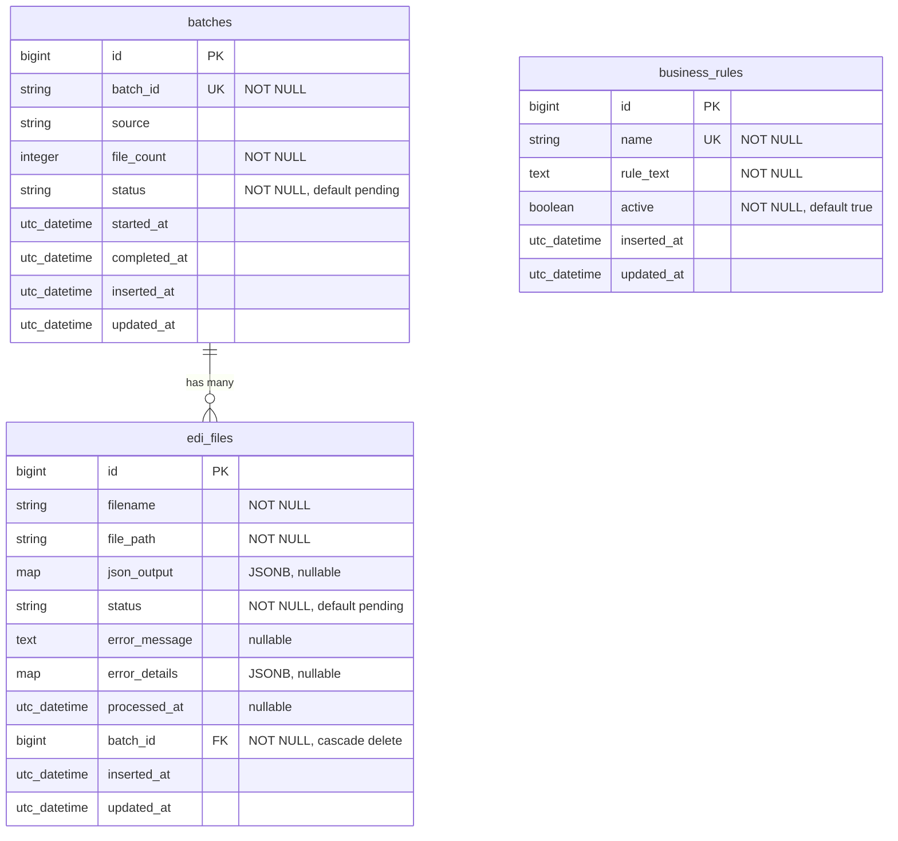

# Database Entity Relationship Diagram (In-Use)

Current Ecto/PostgreSQL schema used by the Phoenix app (`X12FraudWeb.Claims`).

## ERD Diagram

## Relationship Notes

- `batches` → `edi_files` is the only foreign-key relationship currently in use.
- `business_rules` is actively used by the app but is currently standalone (no FK relationship).

## Status Domains (from app changesets)

- `batches.status`: `pending`, `processing`, `completed`, `failed`
- `edi_files.status`: `pending`, `translated`, `syntax_error`, `fraudulent`

## Future Expansion (Only If Needed)

Keep the current schema lean unless product requirements require additional governance or audit depth.

Suggested incremental order:

1. Rule versioning (`business_rule_versions`)
2. Execution traceability (`claim_decisions`, `rule_execution_log`)
3. Deployment grouping (`rule_sets`, `rule_set_members`)
4. Compliance audit trail (`audit_log`)

Guideline: implement database complexity at the same pace as shipped product behavior.
