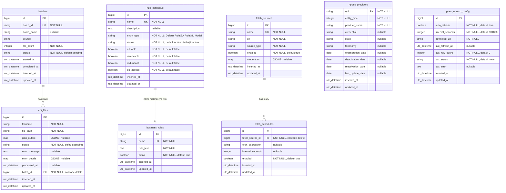

# Database Entity Relationship Diagram (In-Use)

Current Ecto/PostgreSQL schema used by the Phoenix app (`MedicaidClaimsChecker.Claims`).

## ERD Diagram

## Relationship Notes

- `batches` → `edi_files`: only FK relationship in the claims pipeline.
- `fetch_sources` → `fetch_schedules`: FK with cascade delete; a source can have multiple schedules (cron or interval-based).
- `rule_catalogue` → `business_rules`: linked by matching `name` field (no database FK). A `rule_catalogue` entry with `entry_type = "BA Rule"` corresponds to a `business_rules` row with the same name.
- `rule_catalogue` is the authoritative registry for all rule types (Default Rule, BA Rule, ML Model). `business_rules` stores the DSL text only for BA Rules.
- `nppes_providers` and `nppes_refresh_config` are standalone tables (no FKs to other tables).

## Indexes

- `nppes_providers`: `state`, `deactivation_date`
- `fetch_sources`: `name` (unique)
- `fetch_schedules`: `fetch_source_id`

## Status and Enum Domains (from app changesets)

- `batches.status`: `pending`, `processing`, `completed`, `failed`
- `edi_files.status`: `pending`, `translated`, `syntax_error`, `fraudulent`
- `rule_catalogue.status`: `Active`, `Inactive`
- `rule_catalogue.entry_type`: `Default Rule`, `BA Rule`, `ML Model`
- `fetch_sources.source_type`: application-defined (e.g. `sftp`, `https`)
- `nppes_refresh_config.last_status`: `never`, `ok`, `error`

## Future Expansion (Only If Needed)

Keep the current schema lean unless product requirements require additional governance or audit depth.

Suggested incremental order:

1. Rule versioning (`business_rule_versions`)
2. Execution traceability (`claim_decisions`, `rule_execution_log`)
3. Deployment grouping (`rule_sets`, `rule_set_members`)
4. Compliance audit trail (`audit_log`)

Guideline: implement database complexity at the same pace as shipped product behavior.
